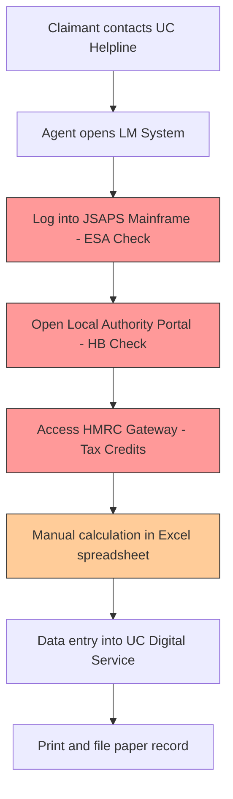

## AS-IS Process: Legacy Benefits Verification (The "Swivel Chair")

Current state requires agents to manually query multiple disconnected systems.

**Pain Points:**
- 4 system logins per claimant (avg. 12 mins)
- Manual Excel calculations (error rate 8%)
- No audit trail between systems
