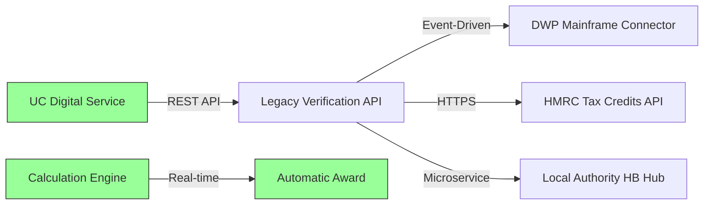

## TO-BE Process: API-First Architecture

Proposed state eliminates manual checks through real-time API integration.

**Business Benefits:**
- Single system interaction (45 seconds vs 12 minutes)
- Zero manual calculation errors
- Full audit trail via API logs
- TCS "Machine First" compliant
